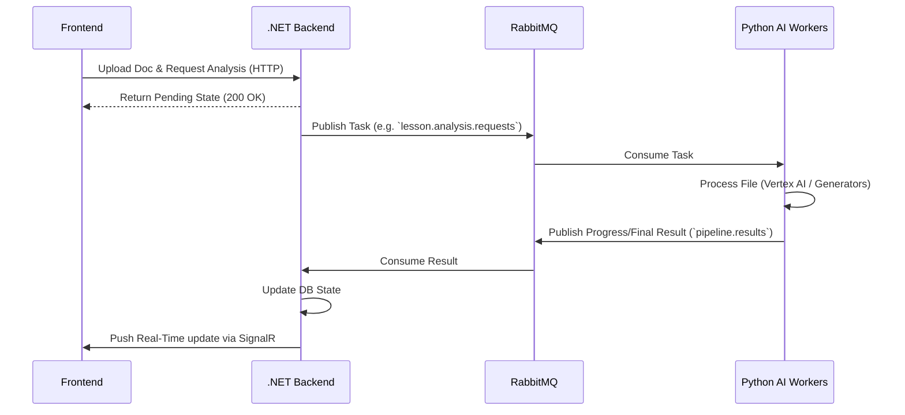

# 🧠 EduVi AI Microservices (SEP490_AI)

[](https://www.python.org/)
[](https://www.docker.com/)
[](https://www.rabbitmq.com/)
[](https://neo4j.com/)
[](#)

> An ecosystem of asynchronous Python AI microservices for the **EduVi** platform. This repository powers the heavy-lifting tasks such as LLM-based lesson plan analysis, slide generation, text-to-speech video rendering, gamification, and curriculum ingestion.

---

> **⚠️ Deployment Guide Available!**
> Trying to push these workers to the cloud or set up the full VM infrastructure with the `.NET` repo? Please read our comprehensive **[AI Deployment Guide](DEPLOYMENT_GUIDE.md)** for instructions on architecture, Docker configuration, GitHub Actions, and securely tunneling into RabbitMQ.

---

## 📑 Table of Contents

- [Overview](#overview)
- [Architecture & Event Flow](#architecture--event-flow)
- [Microservices Portfolio](#microservices-portfolio)
- [Project Structure](#project-structure)
- [Tech Stack](#tech-stack)
- [Getting Started](#getting-started)
  - [Prerequisites](#prerequisites)
  - [Running with Docker (Recommended)](#running-with-docker-recommended)
  - [Local Development (Without Docker)](#local-development-without-docker)
- [Communication Protocol](#communication-protocol)

---

---

## 🚀 Overview

The **SEP490_AI** monorepo contains independent AI workers. Each worker listens to specific RabbitMQ queues, processes tasks generated by the backend API, generates digital assets (slides, videos, JSON structures) or analyzes documents, and publishes the results/progress back to the system.

---

## 🏛️ Architecture & Event Flow

The AI pipeline is entirely asynchronous. It completely isolates computationally heavy, long-polling generation tasks from the responsive C# Backend.



---

## 🧩 Microservices Portfolio

| Service Name | Description | Key Sub-components |
|---|---|---|
| **lesson_analysis** | Analyzes uploaded lesson plans (PDF/DOCX) against textbook standards loaded in Neo4j. | Extractors, Evaluators (LLMs), Neo4j Client |
| **slide_generator** | Assembles PowerPoint slide payloads based on evaluated text and visual requirements. | Assembler, Content Generator, Templates |
| **video_generator** | Generates text-to-speech, renders visuals into cohesive digital video products. | Renderer, TTS utility |
| **game_quiz** | Extracts pedagogical payloads to generate gamified quiz formats. | Payload Extractor |
| **curriculum_ingestion** | Parses curricula and standards and maps them into the knowledge graph. | Mappers, Neo4j Loader, Parsers |
| **textbook_ingestion** | Chunks, embeds, and loads textbook entities into the knowledge graph. | Chunker, Entity Generators |
| **ai_review** | Handles periodic AI monitoring or automated quality reviews across materials. | Quality Reviewer |

---

## 📁 Project Structure

```text
SEP490_AI/
├── ai_review/              # Quality review service worker
├── curriculum_ingestion/   # Knowledge graph ingestion worker
├── game_quiz/              # Gamified payload generator worker
├── lesson_analysis/        # Document evaluation worker
├── slide_generator/        # Slide assembly and content planner
├── textbook_ingestion/     # High-volume textbook chunking/embedding worker
├── video_generator/        # Multimedia rendering and TTS worker
├── private/                # Hidden keys (e.g., gcp-key.json)
├── test/                   # Integration and standalone testing scripts
├── .github/workflows/      # CI/CD deployment pipelines per service
├── DOCKER_GUIDE.txt        # Cheatsheet for operational Docker commands
├── docker-compose.dev.yml  # Local development compose file
└── redeploy.bat            # Quick orchestrator script for Windows
```

---

## 🛠️ Tech Stack

- **Python 3.10+**: Core language for AI services.
- **Google Vertex AI / Gemini**: Foundational LLMs for reasoning and payload generation.
- **Neo4j**: Graph database representing educational standards, concepts, and locations.
- **Google Cloud Storage (GCS)**: Blob storage for documents and resulting artifacts.
- **RabbitMQ (pika)**: Message broker connecting workers.
- **Docker**: For sandboxing and deployment consistency.

---

## 💻 Getting Started

### Prerequisites

- [Docker Desktop](https://www.docker.com/products/docker-desktop)
- Python 3.10+
- Google Cloud Service Account Key (`private/gcp-key.json`)
- An environment file setup (`.env`) in the project root:

```env
NEO4J_URI=neo4j+s://xxxxx.databases.neo4j.io
NEO4J_USER=neo4j
NEO4J_PASSWORD=your_password
GCS_BUCKET_NAME=your_bucket
GOOGLE_CLOUD_PROJECT=your_project
```

### Running with Docker (Recommended)

To start the infrastructure (RabbitMQ, cache) and all AI workers concurrently:

```bash
docker-compose -f docker-compose.dev.yml up -d
```

**Utility Commands:**
```bash
# Rebuild and start after changes
.\redeploy.bat

# View logs for a specific service
docker-compose logs -f lesson-analysis

# Stop and gracefully terminate running workers
docker-compose down
```

### Local Development (Without Docker)

If you need to debug a specific worker interactively:

1. Spin up RabbitMQ (and Neo4j if not cloud-hosted) via Docker.
2. Navigate into the specific service folder:
   ```bash
   cd lesson_analysis
   pip install -r requirements.txt
   ```
3. Run the worker directly in Python:
   ```bash
   python main.py
   ```
   *(Many workers support a `--cli` flag. Check `main.py` inside the respective directory)*

---

## 📡 Communication Protocol

Services communicate strictly using standard JSON formats over AMQP.

### Incoming Example (from API to Worker)
```json
{
  "taskId": "546de3de-e4c7-47fa-b6cd-9c6bad1e1d0b",
  "userId": "5",
  "productId": 7,
  "gcsUri": "gs://bucket/path/to/file.pdf",
  "subjectCode": "dia_li",
  "gradeCode": "10",
  "lessonCode": "dia_li_10_bai_1"
}
```

### Outgoing Example (Progress / Final Status to API via `pipeline.results`)
```json
{
  "taskId": "546de3de-e4c7-47fa-b6cd-9c6bad1e1d0b",
  "userId": "5",
  "productId": 7,
  "status": "completed",
  "step": "evaluate",
  "progress": 100,
  "detail": "Successfully validated against standard.",
  "result": { "matchingScore": 0.85, "suggestions": [...] },
  "error": null
}
```

**Lifecycle Statuses:** `processing` ➜ `completed` | `failed`

---

*Project Maintained by the SEP490 Capstone Team - 2026.*
